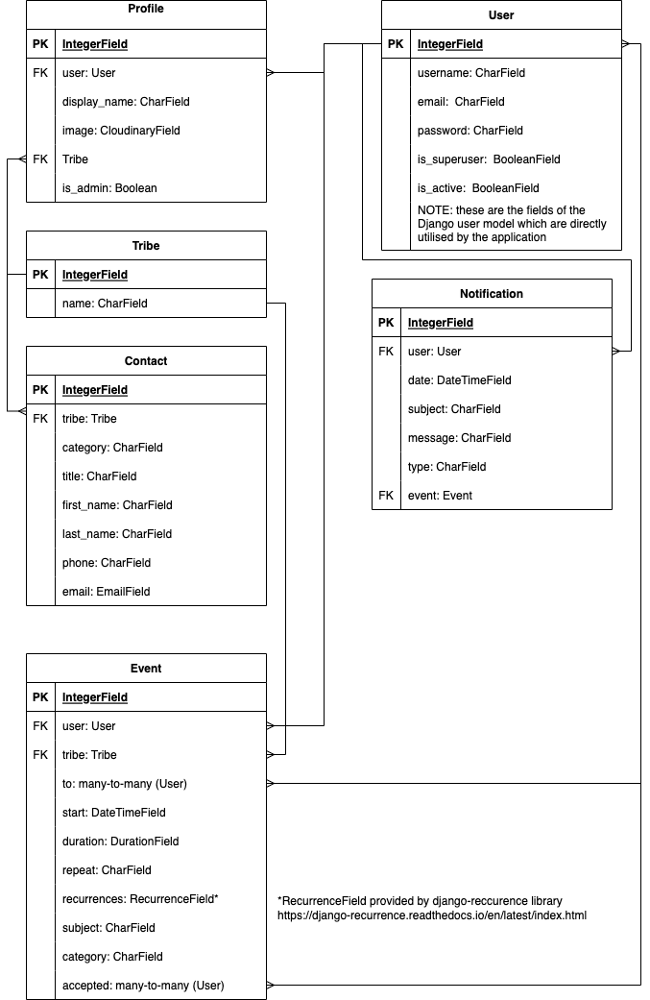

# TribeHub

## Project goals

This project provides a Django Rest Framework backend for the [TribeHub React web app](https://github.com/andy-guttridge/tribehub_react). It has also been designed with a future native iOS app in mind.

TribeHub is intended to be a virtual equivalent to the typical wall planner a family might put up in a kitchen or other communal area. The primary goals of the web app are to:
1) Provide busy families with a single, central hub around which to plan and organise busy lives and schedules. This should include calendar/event scheduling functionality similar to a family wall planner, enabling events to be scheduled for one or multiple family members, and viewed by all the family.
2) Deliver a simple and intuitive user experience, suitable for adults and tech literate children aged 10+. 
3) Offer a minimal set of impactful features chosen in order to deliver a useful app within an achievable development timeframe, while laying a solid foundation for additional features in the future.

## Table of contents

## Planning

Planning started by creating epics and user stories for the frontend application, based on the project goals. The user stories were used to inform wireframes mapping out the intended functionality and 'flow' through the app. See the [repo for the frontend React app](https://github.com/andy-guttridge/tribehub_react) for more details.

The user stories requiring implementation to achieve a minimum viable produect (MVP) were then mapped to API endpoints required to support the desired functionality.
The user stories themselves are recorded [on this Google sheet](https://docs.google.com/spreadsheets/d/11wcDHeqr85VaHXdJjATod_WECRY03IRUlGgT_L_ikIw/edit#gid=0), with the required API endpoints mapped to user stories on [this sheet](https://docs.google.com/spreadsheets/d/11wcDHeqr85VaHXdJjATod_WECRY03IRUlGgT_L_ikIw/edit#gid=311853659).

### Data models

Data model schema were drawn up in parallel with the API endpoints, using an entity relationship diagram.

Custom models implemented for Tribehub are:

#### **Profile**

Represents the user profile, using a one-to-one relationsip to the user model. A Profile instance is automatically created on user registration. The Profile model includes an `is_admin` boolean field, which is used to determine whether a given user has tribe admin privileges. Note that initial user registration creates a profile with tribe admin rights; this user can then create further user accounts for their family members which are added as members of the tribe, and these do not have admin rights.

The Profile model has a many to one relationship with the Tribe model. This is used throught the API to associate users with their tribes.

Users can edit their own `display_name` and `image` fields.

#### **Tribe**

The Tribe model has only one field, which is the name of the tribe. This model is important however, as it is used throughout the API to associate individual users with the appropriate tribe - for example, members of the same tribe can invite each other to calendar events, see each others events in the tribe calendar and access the same key contacts list, but they cannot access these items for tribes to which they do not belong.

### **Event**

The Event model represents a calendar event. It has many to one relationships with the User model (the `user` field) and the Tribe model (the `tribe` field), in order to record who created the event and which tribe they belong to. There are two fields with many to many relationships with the User model - `to` and `accepted` - which record who has been invited to the event and who has accepted the invitation.

The `recurrences` field is an instance of RecurrenceField, provided by the [django-recurrence](https://django-recurrence.readthedocs.io/en/latest/) library. This enables the calculation of recurring events based on a single original date and a set of rules (e.g. weekly, monthly etc). This field is not exposed externally by the API - rather, the `repeat`  field is exposed by the API to allow incoming requests for recurrences using a simple string (`WEK` for weekly, `TWK` for fortnightly, `MON` for monthly, `YEA` for yearly or `NON` for none). The corresponding recurrences rule is then applied by the Event model on save.

Recurring events are not saved in the database. When a GET request to the `events/` endpoint is made by an authenticated user, the `recurrences` field is used to programatically generate any recurrences of events which fall within the requested time range and these are added to the JSON response to the client without creating new objects in the database. 

The `start` field records the start date and time of the event using an unlocalised ISO8601 format datetime string, and the `duration` field records the the length of the event, which is serialized in the format `[DD] [HH:[MM:]]ss[.uuuuuu]`.

`subject` is a character field to describe the subject of the event. `category` is a choices field to record the category of the event as a three character string, which must correspond to one of a list of valid choices.

Any member of a tribe can create a new event. They can only invite members of their own tribe. Users can only retrieve details of events for their own tribe. The user who created an event and the tribe admin can delete events.

### **Notification**

The Notification model represents user notifications. Currently these are implemented for invitations and changes to calendar events, however further notification types could be implemented in the future to compliment additional features.

Notifications are created programatically when a new event is created or details of an existing event changed - there is no API endpoint to directly create a new notification.
Notifications have a many to one relationship with the User model to record who the notification is for, and a one to many relationship to the Event model to record which event the notification relates to. The `event` field can have a value of `None` so that it could be utilised for non-event related functionality in the future.

Users can only access and delete their own notifications.

### **Contact**

The Contact model represents an instance of important contact information for a tribe (e.g. doctor, dentist etc). Contacts can only be created, edited or deleted by the tribe admin user. Users can retrieve details of contacts for their own tribe, and cannot access contacts for other tribes.

    

    Link to full-size diagram: 

    <a href="readme_media/pp5_db_schema.png" target="_rel">Link to full size DB schema</a>

## API endpoints
| **URL** | **Notes** | **HTTP Method** | **CRUD operation** | **View type** | **POST/PUT data format** |
|---|---|---:|---|---:|---|
|  |  |  |  |  |  |
| **Custom user  account endpoints** |  |  |  |  |  |
| /accounts/tribe | Handles creation of a new user account with 'tribe' admin permissions, creates a new user profile and a new tribe attached to that user. | POST | Create | List | {     "username":"string",     "password":"string",     "password2":"string",     "tribename":"string" } |
| /accounts/user | Only tribe admins have permission for this endpoint. Handles creation of a new user account without tribe admin permissions,  creates a new user profile and associates them with the same tribe as the tribe admin who creates the account. | POST | Create | List | {     "username":"string",     "password":"string",     "password2":"string" } |
| /accounts/user/ | Handles deletion of the specified user account and profile. If the action is performed  by the tribe admin, the tribe and all the user accounts associated with it are also deleted. Action can only be performed by users on their own accounts, and by the tribe admin for user accounts which are part of their tribe. | DELETE | Delete | Detail | N/A |
| **Tribe endpoints** |  |  |  |  |  |
| /tribe | Lists all the members of the current authenticated user's tribe. Can't be accessed by non-authenticated users.  | GET | Read | List | N/A |
| **Profile endpoints** |  |  |  |  |  |
| /profile/id | Retrieves profile details for the user id specified in the URL. Only members of the same  tribe as the requested profile can access this data. | GET | Read | Detail | N/A |
| /profile/id | Updates existing user profiles. This action can only be performer by the user  who owns the profile, or the admin of that user's tribe. | PUT | Update | Detail | {     "display_name": "string",     "image": "string",     "is_admin": bool }  Plus image data |
| **Notification endpoints** |  |  |  |  |  |
| /notifications | Lists all notifications for the authenticated user. | GET | Read | List | N/A |
| /notifications/id | Deletes the specified notification. This action can only be performed by the owner of the notification. | DELETE | Delete | Detail | N/A |
| **Event endpoints** |  |  |  |  |  |
| /events | Returns all the scheduled events for the tribe to which the authenticated user belongs. If no dates are specified, the next two months events are returned.  This endpoint programatically generates repeat occurrences where a repeat type has been  specified for an event, i.e. repeats are not stored in the database. Repeat occurrences  are indicated with a 'recurrence_type' value of 'REC'.  The following URL parameters are optionally available with this end point:  from_date=YYYY-MM-DDThh:mm:ss - accepts an ISO8601 format date and returns all events for the tribe from the  specified date up until the specified to_date, or for the next two months if no to_date is  specified.  to_date=YYYY-MM-DDThh:mm:ss - accepts an ISO8601 format date and returns all events for the tribe from today  or from the specified from_date.  category=string - accepts a valid category code and returns corresponding events   to=int - returns events to which the specified user is invited. Users who are not part of the same tribe cannot access this data.  search=string - returns events where the search term is found in the subject field. | GET | Read | List | N/A |
| /events | Creates a new event for the tribe to which the user belongs. Only users in the same tribe as the authenticated user can be invited.   Valid recurrence types are: NON = None WEK = Weekly TWK = Two weekly MON = Monthly YEA = Yearly  Valid category strings are in events/event_values.py | POST | Create | List | {      "to": [id, id...],     "start": "YYYY-MM-DDThh:mm:ss",     "duration": float,     "recurrence_type": "String",     "subject": "String",     "category": "String" } |
| /events/id | Returns details of a single event. Data is restricted to users who are members of the tribe  with which the event associated. | GET | Read | List | N/A |
| /events/id | Updates details of an existing event. This action is restricted to the user who created the  event and the tribe admin. | PUT | Update | Detail | {      "to": [id, id...],     "start": "YYYY-MM-DDThh:mm:ss",     "duration": float,     "recurrence_type": "String",     "subject": "String",     "category": "String" } |
| /events/id | Deletes the specified event. This action is restricted to the user who created the  event and the tribe admin. | DELETE | Delete | Detail | N/A |
| /events/response/id | Records the authenticated user as having accepted or declined an invitation to  the specified event. Returns an error message if the user was not invited. | PUT | Update | Detail | {     "event_response":"accept" OR "decline" } |
| **Contact endpoints** |  |  |  |  |  |
| /contacts | Returns all the contacts for the authenticated user's tribe.  Accepts a URL search parameter and returns results where a match is found in the category, title, first_name, last_name, phone or email fields.| GET | Read | List | N/A |
| /contacts | Creates a new contact for the authenticated user's tribe. This action is restricted to tribe admins. | POST | Create | List | {     "category": "String",     "title": "String",     "first_name": "String",     "last_name": "String",     "phone": "String",     "email": "String" } |
| /contacts/id | Updates details of an existing contact for the user's tribe. This action is restricted to tribe admins. | PUT | Update | Detail | {     "category": "String",     "title": "String",     "first_name": "String",     "last_name": "String",     "phone": "String",     "email": "String" } |
| /contacts/id | Delete the specified contact. This action is restricted to the admin of the tribe  to which the contact is associated. | DELETE | Delete | Detail | N/A |

Table generated using https://www.tablesgenerator.com/markdown_tables/load

## Frameworks, libraries and dependencies
**Need to provide rationale for choices**

### Cloudinary Storage

### dj-all-auth

### dj-rest-auth

### djangorestframework-simplejwt

### dj-database-url

### psychopg2

### python-dateutil

This is a pre-requisite for django-recurrence

### django-recurrence

### django-filter

### django-cors-headers

## Testing

### Manual testing

A series of manual tests were carried out for each end point. Please see the separate [testing.md](/testing.md) document for details.

### Python validation

All files containing custom Python code were validated using the [Code Institute Python Linter](https://pep8ci.herokuapp.com/):

- `contacts/admin.py`: no errors found
- `contacts/models.py`: no errors found
- `contacts/serializers.py`: no errors found
- `contacts/urls.py`: no errors found
- `contacts/views.py`: no errors found

- `events/admin.py`: no errors found
- `events/event_values.py`: no errors found
- `events/filters.py`: no errors found
- `events/models.py`: no errors found
- `events/serializers.py`: no errors found
- `events/urls.py`: no errors found
- `events/utils.py`: no errors found
- `events/views.py`: no errors found

- `notifications/admin.py`: no errors found
- `notifications/models.py`: no errors found
- `notifications/notification_values.py`: no errors found
- `notifications/serializers.py`: no errors found
- `notifications/urls.py`: no errors found
- `notifications/views.py`:no errors found

- `profiles/admin.py`: no errors found
- `profiles/models.py`: no errors found
- `profiles/serializers.py`: no errors found
- `profiles/urls.py`: no errors found
- `profiles/views.py`: no errors found  

- `tribehub_drf/permissions.py`: no errors found
- `tribehub_drf/serializers.py`: no errors found
- `tribehub_drf/settings.py`: no errors found
- `tribehub_drf/urls.py`: no errors found  
- `tribehub_drf/views.py`: no errors found

- `tribes/admin.py`: no errors found
- `tribes/models.py`: no errors found
- `tribes/serializers.py`: no errors found
- `tribes/urls.py`: no errors found
- `tribes/views.py`: no errors found

### Resolved bugs

- During testing, it became apparent that a user could not create a calendar event with no other members of the tribe invited (i.e. events only for themselves), because the `to` field on the `Event` model defaulted to not allowing null values. This was fixed by adding `null=True` and `blank=True` arguments to the model.
- Testing also revealed that the programatically generated events returned as repeat occurences included the currently authenticated user rather than the user who created the event as the owner. This was fixed by changing two variables in `events/utils.py`.
- Testing demonstrated that sending using an id for a non-existent event object for the `events/response/<id>` endpoint resulted in an uncaught exception. Try...except blocks were added to  the EventResponse class in `events/views.py` to ensure any references to non-existent events are handled gracefully alongside permission related errors, and that appropriate HTTP status codes are returned for each class of error.

### Unresolved bugs

- The `perform_create` method of the `ListCreate` generic view is overriden in `contacts/views.py`. Django did not seem to respond correctly to custom permission classes when this method is overriden, meaning that unauthorised users (i.e. authenticated users without tribe admin status) were able create new contacts. It was verified that the relevant custom permission classes were being called and returning the correct values, and it remains uncertain whether this issue is due to a bug in Django Rest Framework or in this project. The issue was overcome by manually checking the status of the user, but given more time it would be good to look into this further and revert to correct use of permission classes if possible.

## Deployment

## Credits

- How to fully define a field within an array field from [Stack Overflow](https://stackoverflow.com/questions/41180829/arrayfield-missing-1-required-positional-argument)
- Technique to limit the size of image uploads to cloudinary adapted from this [Cloudinary](https://support.cloudinary.com/hc/en-us/community/posts/360009752479-How-to-resize-before-uploading-pictures-in-Django) support article
- Replacement for deprecated `django.conf.urls.url()` implemented as per this [StackOverflow article](https://stackoverflow.com/questions/70319606/importerror-cannot-import-name-url-from-django-conf-urls-after-upgrading-to)
- Approach to creating a string representation of a many to many field in the Django admin panel from https://stackoverflow.com/questions/18108521/many-to-many-in-list-display-django
- Technique to create a custom filter for date ranges using django-filters adapted from this [StackOverflow article](https://stackoverflow.com/questions/37183943/django-how-to-filter-by-date-with-django-rest-framework)
- How to access URL arguments as kwargs in generic APIViews from this [StackOverflow article](https://stackoverflow.com/questions/51042871/how-to-access-url-kwargs-in-generic-api-views-listcreateapiview-to-be-more-spec)
- How to filter on many-to-many fields is from this [StackOverflow article](https://stackoverflow.com/questions/4507893/django-filter-many-to-many-with-contains)
- Technique to use Python pattern matching as case statements from this [StackOverflow article](https://stackoverflow.com/questions/11479816/what-is-the-python-equivalent-for-a-case-switch-statement)
- Technique to override model `save()` method to programatically set the value of fields based on the value of other fields from this [StackOverflow article]:(https://stackoverflow.com/questions/11479816/what-is-the-python-equivalent-for-a-case-switch-statement)
- Approach to obtaining the current user context within a model serializer from [Stackoverflow](https://stackoverflow.com/questions/30203652/how-to-get-request-user-in-django-rest-framework-serializer)
- Technique to use different serializers depending on HTTP request type within the same generic class view from [Stackoverflow](https://stackoverflow.com/questions/22616973/django-rest-framework-use-different-serializers-in-the-same-modelviewset)

In addition, the following documentation was extensively referenced throughout development:

- Django documentation
- Django Rest Framework documentation
- django-filter documentation
- django-recurrence documentation
- Python datetime documentation

